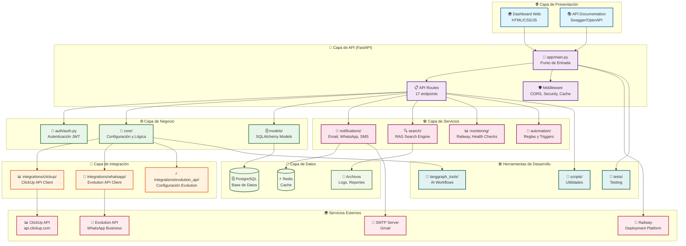
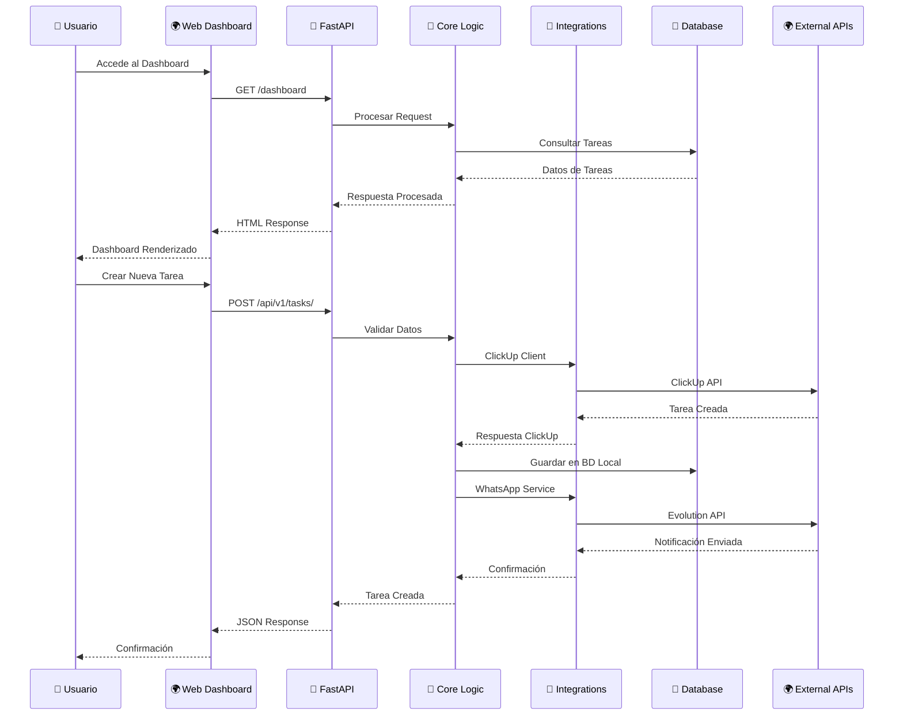
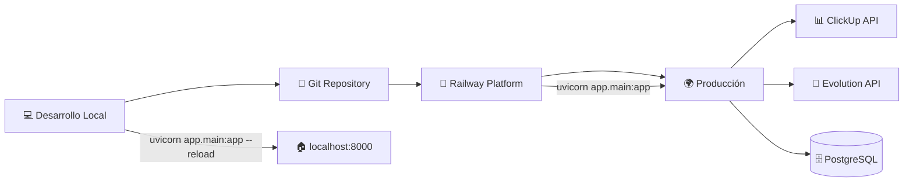

# 🏗️ Arquitectura del Proyecto ClickUp Project Manager

## 📊 Diagrama de Arquitectura General

## 🔄 Flujo de Datos Principal

## 🏗️ Estructura de Directorios Detallada

```mermaid
graph TD
    ROOT[📁 ClickUp_Project_Manager]
    
    %% Aplicación Principal
    ROOT --> APP[📁 app/<br/>🚀 Aplicación Principal]
    APP --> MAIN[📄 main.py<br/>Punto de Entrada FastAPI]
    
    %% Autenticación
    ROOT --> AUTH_DIR[📁 auth/<br/>🔐 Sistema de Autenticación]
    AUTH_DIR --> AUTH_FILE[📄 auth.py<br/>JWT y Autorización]
    
    %% Integraciones
    ROOT --> INT_DIR[📁 integrations/<br/>🔌 Integraciones Externas]
    INT_DIR --> CLICKUP_DIR[📁 clickup/<br/>📊 ClickUp API]
    INT_DIR --> WHATSAPP_DIR[📁 whatsapp/<br/>📱 WhatsApp Evolution]
    INT_DIR --> EVOLUTION_DIR[📁 evolution_api/<br/>⚡ Configuración Evolution]
    
    CLICKUP_DIR --> CLICKUP_CLIENT[📄 client.py<br/>Cliente ClickUp]
    CLICKUP_DIR --> CLICKUP_SYNC[📄 sync.py<br/>Sincronización]
    CLICKUP_DIR --> CLICKUP_WEBHOOK[📄 webhook_manager.py<br/>Gestión Webhooks]
    
    WHATSAPP_DIR --> WHATSAPP_CLIENT[📄 client.py<br/>Cliente WhatsApp]
    WHATSAPP_DIR --> WHATSAPP_INTEGRATOR[📄 integrator.py<br/>Integrador Principal]
    WHATSAPP_DIR --> WHATSAPP_SERVICE[📄 service.py<br/>Servicios WhatsApp]
    WHATSAPP_DIR --> WHATSAPP_SIMULATOR[📄 simulator.py<br/>Simulador Desarrollo]
    
    %% Monitoreo
    ROOT --> MONITOR_DIR[📁 monitoring/<br/>📊 Monitoreo y Alertas]
    MONITOR_DIR --> RAILWAY_DIR[📁 railway/<br/>🚂 Monitoreo Railway]
    MONITOR_DIR --> HEALTH_DIR[📁 health/<br/>❤️ Health Checks]
    
    %% Búsqueda
    ROOT --> SEARCH_DIR[📁 search/<br/>🔍 Motor de Búsqueda]
    SEARCH_DIR --> SEARCH_ENGINE[📄 engine.py<br/>RAG Search Engine]
    
    %% Notificaciones
    ROOT --> NOTIF_DIR[📁 notifications/<br/>📧 Sistema de Notificaciones]
    NOTIF_DIR --> NOTIF_MANAGER[📄 manager.py<br/>Gestor Principal]
    NOTIF_DIR --> NOTIF_ADVANCED[📄 advanced_manager.py<br/>Gestor Avanzado]
    NOTIF_DIR --> NOTIF_AUTO[📄 automated_manager.py<br/>Gestor Automatizado]
    NOTIF_DIR --> NOTIF_SCHEDULER[📄 scheduler.py<br/>Programador]
    NOTIF_DIR --> EMAIL_DIR[📁 email/<br/>📧 Plantillas Email]
    NOTIF_DIR --> WHATSAPP_NOTIF[📁 whatsapp/<br/>📱 Notificaciones WhatsApp]
    
    %% Scripts
    ROOT --> SCRIPTS_DIR[📁 scripts/<br/>📜 Scripts Organizados]
    SCRIPTS_DIR --> SCRIPTS_CLICKUP[📁 clickup/<br/>📊 Scripts ClickUp]
    SCRIPTS_DIR --> SCRIPTS_WHATSAPP[📁 whatsapp/<br/>📱 Scripts WhatsApp]
    SCRIPTS_DIR --> SCRIPTS_RAILWAY[📁 railway/<br/>🚂 Scripts Railway]
    SCRIPTS_DIR --> SCRIPTS_DB[📁 database/<br/>🗄️ Scripts Base de Datos]
    
    %% API
    ROOT --> API_DIR[📁 api/<br/>🌐 API REST FastAPI]
    API_DIR --> ROUTES_DIR[📁 routes/<br/>📋 Endpoints API]
    API_DIR --> SCHEMAS_DIR[📁 schemas/<br/>📝 Esquemas Pydantic]
    
    ROUTES_DIR --> TASKS_ROUTE[📄 tasks.py<br/>Gestión Tareas]
    ROUTES_DIR --> USERS_ROUTE[📄 users.py<br/>Gestión Usuarios]
    ROUTES_DIR --> WORKSPACES_ROUTE[📄 workspaces.py<br/>Gestión Workspaces]
    ROUTES_DIR --> AUTH_ROUTE[📄 auth.py<br/>Autenticación]
    ROUTES_DIR --> WEBHOOKS_ROUTE[📄 webhooks.py<br/>Webhooks]
    ROUTES_DIR --> WHATSAPP_ROUTE[📄 whatsapp.py<br/>Endpoints WhatsApp]
    ROUTES_DIR --> DASHBOARD_ROUTE[📄 dashboard.py<br/>Dashboard]
    ROUTES_DIR --> SEARCH_ROUTE[📄 search.py<br/>Búsqueda]
    ROUTES_DIR --> REPORTS_ROUTE[📄 reports.py<br/>Reportes]
    ROUTES_DIR --> AUTOMATION_ROUTE[📄 automation.py<br/>Automatización]
    ROUTES_DIR --> INTEGRATIONS_ROUTE[📄 integrations.py<br/>Integraciones]
    ROUTES_DIR --> SPACES_ROUTE[📄 spaces.py<br/>Espacios]
    ROUTES_DIR --> LISTS_ROUTE[📄 lists.py<br/>Listas]
    ROUTES_DIR --> RAILWAY_MONITOR_ROUTE[📄 railway_monitor.py<br/>Monitoreo Railway]
    ROUTES_DIR --> AUTOMATION_CONTROL_ROUTE[📄 automation_control.py<br/>Control Automatización]
    ROUTES_DIR --> WHATSAPP_DIAGNOSTICS_ROUTE[📄 whatsapp_diagnostics.py<br/>Diagnósticos WhatsApp]
    
    %% Core
    ROOT --> CORE_DIR[📁 core/<br/>⚙️ Núcleo del Sistema]
    CORE_DIR --> CONFIG[📄 config.py<br/>Configuración Aplicación]
    CORE_DIR --> DATABASE[📄 database.py<br/>Configuración BD]
    CORE_DIR --> PHONE_EXTRACTOR[📄 phone_extractor.py<br/>Extracción Teléfonos]
    CORE_DIR --> ROBUST_WHATSAPP[📄 robust_whatsapp_service.py<br/>Servicio WhatsApp Robusto]
    
    %% Modelos
    ROOT --> MODELS_DIR[📁 models/<br/>🗄️ Modelos SQLAlchemy]
    MODELS_DIR --> TASK_MODEL[📄 task.py<br/>Modelo Tareas]
    MODELS_DIR --> USER_MODEL[📄 user.py<br/>Modelo Usuarios]
    MODELS_DIR --> WORKSPACE_MODEL[📄 workspace.py<br/>Modelo Workspaces]
    MODELS_DIR --> NOTIFICATION_LOG_MODEL[📄 notification_log.py<br/>Log Notificaciones]
    MODELS_DIR --> AUTOMATION_MODEL[📄 automation.py<br/>Modelo Automatización]
    MODELS_DIR --> REPORT_MODEL[📄 report.py<br/>Modelo Reportes]
    MODELS_DIR --> INTEGRATION_MODEL[📄 integration.py<br/>Modelo Integraciones]
    
    %% Utilidades
    ROOT --> UTILS_DIR[📁 utils/<br/>🛠️ Utilidades y Helpers]
    UTILS_DIR --> HELPERS[📄 helpers.py<br/>Funciones Auxiliares]
    UTILS_DIR --> DEPLOYMENT_LOGGER[📄 deployment_logger.py<br/>Logger Despliegues]
    
    %% LangGraph Tools
    ROOT --> LANGGRAPH_DIR[📁 langgraph_tools/<br/>🤖 Herramientas LangGraph]
    LANGGRAPH_DIR --> SYNC_WORKFLOW[📄 sync_workflow.py<br/>Flujo Sincronización]
    LANGGRAPH_DIR --> RAG_SEARCH_WORKFLOW[📄 rag_search_workflow.py<br/>Flujo Búsqueda RAG]
    LANGGRAPH_DIR --> ERROR_LOGGING_WORKFLOW[📄 error_logging_workflow.py<br/>Flujo Logging Errores]
    
    %% Archivos Estáticos
    ROOT --> STATIC_DIR[📁 static/<br/>🎨 Archivos Estáticos]
    STATIC_DIR --> DASHBOARD_HTML[📄 dashboard.html<br/>Dashboard Principal]
    STATIC_DIR --> INDEX_HTML[📄 index.html<br/>Página Inicial]
    STATIC_DIR --> USERS_TASKS_HTML[📄 users_tasks_table.html<br/>Tabla Usuarios-Tareas]
    STATIC_DIR --> RAILWAY_DASHBOARD_HTML[📄 railway_dashboard.html<br/>Dashboard Railway]
    STATIC_DIR --> CSS_FILES[📄 *.css<br/>Estilos CSS]
    STATIC_DIR --> JS_FILES[📄 *.js<br/>JavaScript]
    
    %% Templates
    ROOT --> TEMPLATES_DIR[📁 templates/<br/>📄 Plantillas HTML]
    
    %% Datos y Logs
    ROOT --> DATA_DIR[📁 data/<br/>📊 Datos y Reportes]
    ROOT --> LOGS_DIR[📁 logs/<br/>📝 Archivos de Log]
    
    %% Tests
    ROOT --> TESTS_DIR[📁 tests/<br/>🧪 Tests Unitarios]
    
    %% Archivos de Configuración
    ROOT --> CONFIG_FILES[📄 Archivos de Configuración]
    CONFIG_FILES --> ENV_EXAMPLE[📄 env.example<br/>Variables Entorno Ejemplo]
    CONFIG_FILES --> ENV_LOCAL[📄 env.local<br/>Variables Entorno Local]
    CONFIG_FILES --> ENV_PRODUCTION[📄 env.production<br/>Variables Entorno Producción]
    CONFIG_FILES --> REQUIREMENTS[📄 requirements.txt<br/>Dependencias Python]
    CONFIG_FILES --> PYPROJECT[📄 pyproject.toml<br/>Configuración Proyecto]
    CONFIG_FILES --> PROCFILE[📄 Procfile<br/>Configuración Railway]
    CONFIG_FILES --> RAILWAY_JSON[📄 railway.json<br/>Configuración Railway]
    CONFIG_FILES --> DOCKER_COMPOSE[📄 docker-compose*.yml<br/>Configuración Docker]
    
    %% Documentación
    ROOT --> DOCS[📄 Documentación]
    DOCS --> README[📄 README.md<br/>Documentación Principal]
    DOCS --> ESTRUCTURA[📄 ESTRUCTURA_PROYECTO.md<br/>Estructura Proyecto]
    DOCS --> MIGRATION_SUMMARY[📄 migration_summary.md<br/>Resumen Migración]
    DOCS --> DEPENDENCY_ANALYSIS[📄 dependency_analysis.md<br/>Análisis Dependencias]
    DOCS --> WHATSAPP_FIX_SUMMARY[📄 WHATSAPP_FIX_SUMMARY.md<br/>Resumen Fix WhatsApp]
```

## 🔧 Componentes Técnicos Principales

### 🚀 **Aplicación Principal (FastAPI)**
- **Punto de entrada**: `app/main.py`
- **Framework**: FastAPI con Uvicorn
- **Puerto**: 8000 (desarrollo) / Railway (producción)
- **Características**: 
  - Middleware CORS y seguridad
  - Headers de cache agresivos
  - Lifespan management
  - 17 endpoints de API organizados

### 🔌 **Sistema de API (17 Endpoints)**
1. **Tasks** (`/api/v1/tasks/`) - CRUD completo de tareas
2. **Users** (`/api/v1/users/`) - Gestión de usuarios
3. **Workspaces** (`/api/v1/workspaces/`) - Gestión de espacios de trabajo
4. **Lists** (`/api/v1/lists/`) - Gestión de listas
5. **Spaces** (`/api/v1/spaces/`) - Gestión de espacios
6. **Auth** (`/api/v1/auth/`) - Autenticación JWT
7. **Webhooks** (`/api/v1/webhooks/`) - Gestión de webhooks
8. **Dashboard** (`/api/v1/dashboard/`) - Endpoints del dashboard
9. **Search** (`/api/v1/search/`) - Búsqueda semántica RAG
10. **Reports** (`/api/v1/reports/`) - Generación de reportes
11. **Automation** (`/api/v1/automation/`) - Reglas de automatización
12. **Integrations** (`/api/v1/integrations/`) - Gestión de integraciones
13. **WhatsApp** (`/api/v1/whatsapp/`) - Endpoints WhatsApp
14. **WhatsApp Diagnostics** (`/api/v1/whatsapp-diagnostics/`) - Diagnósticos
15. **Railway Monitor** (`/railway-monitor/`) - Monitoreo Railway
16. **Automation Control** (`/api/v1/automation-control/`) - Control automatización
17. **Health Check** (`/health`) - Verificación de salud

### 🗄️ **Base de Datos (PostgreSQL)**
- **Modelos principales**:
  - `Task` - Tareas de ClickUp
  - `User` - Usuarios del sistema
  - `Workspace` - Espacios de trabajo
  - `NotificationLog` - Log de notificaciones
  - `Automation` - Reglas de automatización
  - `Report` - Reportes generados
  - `Integration` - Configuraciones de integración

### 🔗 **Integraciones Externas**

#### 📊 **ClickUp API**
- **Cliente**: `integrations/clickup/client.py`
- **Funcionalidades**:
  - CRUD completo de tareas
  - Gestión de workspaces, spaces, lists
  - Sincronización bidireccional
  - Manejo de campos personalizados
  - Webhooks y notificaciones

#### 📱 **WhatsApp Evolution API**
- **Cliente**: `integrations/whatsapp/client.py`
- **Servicio robusto**: `core/robust_whatsapp_service.py`
- **Funcionalidades**:
  - Envío de mensajes de texto
  - Notificaciones automáticas
  - Simulador para desarrollo
  - Sistema de reintentos
  - Extracción de números de teléfono

### 📧 **Sistema de Notificaciones**
- **Email**: SMTP (Gmail)
- **WhatsApp**: Evolution API
- **SMS**: Twilio (deshabilitado)
- **Telegram**: Bot API (deshabilitado)
- **Características**:
  - Notificaciones automáticas por eventos
  - Plantillas personalizables
  - Logging completo
  - Sistema de reintentos

### 🔍 **Motor de Búsqueda RAG**
- **Archivo**: `search/engine.py`
- **Tecnología**: Sentence Transformers
- **Funcionalidades**:
  - Búsqueda semántica
  - Indexación de tareas
  - Búsqueda por criterios específicos
  - Sugerencias automáticas

### 🤖 **Automatización con LangGraph**
- **Herramientas**: `langgraph_tools/`
- **Workflows**:
  - Sincronización de tareas
  - Búsqueda RAG
  - Logging de errores
- **Características**:
  - Flujos de trabajo inteligentes
  - Manejo de errores automático
  - Logging estructurado

### 📊 **Monitoreo y Observabilidad**
- **Railway**: Monitoreo de despliegues
- **Health Checks**: Verificación de salud del sistema
- **Logging**: Sistema de logs estructurado
- **Métricas**: Seguimiento de performance

## 🚀 **Flujo de Despliegue**

## 🔧 **Tecnologías Utilizadas**

### **Backend**
- **FastAPI** - Framework web moderno
- **SQLAlchemy** - ORM para base de datos
- **Pydantic** - Validación de datos
- **Uvicorn** - Servidor ASGI

### **Base de Datos**
- **PostgreSQL** - Base de datos principal
- **Redis** - Cache (configurado pero no implementado)

### **Integraciones**
- **ClickUp API v2** - Gestión de tareas
- **Evolution API** - WhatsApp Business
- **SMTP** - Correo electrónico
- **Twilio** - SMS (deshabilitado)

### **IA y Machine Learning**
- **LangGraph** - Flujos de trabajo con IA
- **Sentence Transformers** - Búsqueda semántica
- **RAG** - Retrieval Augmented Generation

### **Despliegue**
- **Railway** - Plataforma de despliegue
- **Docker** - Containerización
- **Git** - Control de versiones

### **Frontend**
- **HTML5/CSS3/JavaScript** - Dashboard web
- **Responsive Design** - Diseño adaptativo

## 📈 **Métricas y Monitoreo**

- **Health Checks** automáticos
- **Logging estructurado** con LangGraph
- **Monitoreo de Railway** en tiempo real
- **Métricas de performance** de API
- **Seguimiento de notificaciones** WhatsApp
- **Logs de sincronización** ClickUp

## 🔒 **Seguridad**

- **JWT** para autenticación
- **CORS** configurado
- **Headers de seguridad** HTTPS
- **Validación de datos** con Pydantic
- **Manejo seguro de tokens** API
- **Logs de auditoría** completos

---

**ClickUp Project Manager** - Una arquitectura moderna, escalable y robusta para la gestión inteligente de tareas con integración completa de ClickUp y WhatsApp. 🚀
